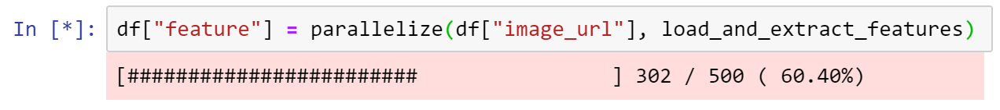

# py-parallelize

This package lets you parallelize computations.



It is a:
- drop-in replacemenet for `map`, `apply`, and `for`.
- wrapper around `multiprocessing`.
- quick and relatively tidy way to parallelize computations
- nice choice if your data does not fit into dask's data model, but you do not want to write enormous amounts of code
using raw joblib/multitask/ipyparallel : everything is wrapped neatly here

It is **NOT** a great idea to use this package if:
- you will rely heavily on parallel computations, or need something more than plain `map` (for example, computation graphs). 
Please refer to [dask](https://dask.org/), as it provides mode functionality.
- you are starting project from scratch, using Jupyter and have a spare hour or two. In this case please spend this time
productively by getting used to verbose but fantastic [ipyparallel](https://ipyparallel.readthedocs.io/en/latest/) API.
- you are operating primarily with numpy arrays / vectorized operations. [Numba](http://numba.pydata.org/) is a great 
fit for such tasks.

# Examples

## Parallelizing map and list comprehension

```python
def some_fun(x):
    return x ** 2
x = [1, 2, 3]

# Single-thread variants
y = [some_fun(i) for i in x]
y = map(some_fun(i) for i in x)

# Parallelized variant
y = parallelize(x, some_fun)
```

A bit more practical example. This snippet loads images from URLs, resizes them, and transforms into a feature vector
using VGG19 pre-trained on Imagenet.

```python
import tensorflow as tf
from pyparallelize import parallelize
import keras.applications.vgg19 as vgg
from skimage.io import imread
import cv2
import numpy as np

graph = tf.get_default_graph()
inception_model = vgg.VGG19(weights='imagenet', include_top=False)

def process_image(img_full_path):
    # We have to reattach the graph (because it was created in different thread).
    # Otherwise a <Tensor ... is not an element of this graph> exception will be raised
    with graph.as_default():
        img = imread(img_full_path)
        target_size = (128, 128)
        img = cv2.resize(img, dsize=target_size, interpolation=cv2.INTER_CUBIC)
        img = np.array([img]).astype(np.float)
        img = vgg.preprocess_input(img)
        vector = np.array(inception_model.predict(img)).reshape(8192)
        return vector

urls = [
    "https://upload.wikimedia.org/wikipedia/commons/c/c4/Savannah_Cat_portrait.jpg",
    "https://upload.wikimedia.org/wikipedia/commons/4/40/BEN_Bengalian_kitten_%284492540155%29.jpg",
    "http://an-url-that-does-not-exist.com/",
    "https://upload.wikimedia.org/wikipedia/commons/7/7b/Cat_Janna.jpg"
]

# We can set number of threads to a number greater than number of CPUs because it's most likely that image downloading
# will be the bottleneck.
x = parallelize(urls, process_image, thread_count=25)
x
```

## Parallel for
It is a bit clumsy to use because it requires multithreading.Manager to create
process-shared lists, but so far it's best way to implement `pfor`.

```python
# Single-thread variant
result = []
for x in range(10):
    result.append(x ** 2)
print(result)
    
# Parallelized variant
from multithreading import Manager

with Manager() as m:
    l = m.list()
    for x in pfor(range(10)):
        l.append(x ** 2)
    print(l)
```

# Features

What's the difference between this and \<insert package name\>?
Well, unlike alternatives and homebrew solutions, this package:
- Has progressbar!
- Does not crash when stopped using Ctrl+C or "Stop" button in Jupyter
- Works in Wandows
- Continues working if stumbled upon occasional exception (i.e. you won't have to rerun whole process just because record #45673 out of 100M is broken)
- Properly works with Series

# What's under the hood?

This package uses `multiprocessing` to launch new threads and processes. It means that there is no GIL-circumvention
logic. Thus, all GIL-related quirks are present. For example, you might not get expected speed-up if your functions
do not spend much time in I/O.

# Installation

Run

`pip3 install git+https://github.com/rampeer/py-parallelize --user`

or

`sudo pip3 install git+https://github.com/rampeer/py-parallelize`
